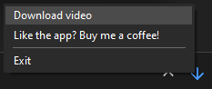
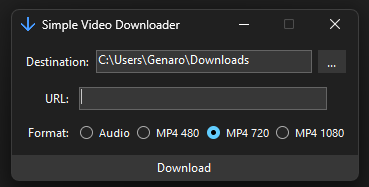

# **SimpleVideoDownloader**

SimpleVideoDownloader is an application designed to download videos easily and efficiently. Just right click on the system tray icon, press download video and paste your link.

  
  

---

## **Installation**
1. Download the .exe from the [Releases](https://github.com/GenaroDS/SimpleVideoDownloader/releases) section.
2. Run `SimpleVideoDownloader.exe`. 
   - Note: The first time you run the application, it might take a moment to initialize.

---

## **Features**
- Download videos in MP4 format in various qualities.
- Extract audio from videos in MP3 format.

---

## **System Requirements**
- **Operating System**: Windows 10 or later.
- **.NET Runtime**: Version 8.0 or higher.
- **Disk Space**: ~200 MB.

---

## **How to Use**
1. Copy the YouTube video link you want to download.
2. Open the app and paste the link in the input field.
3. Select the desired format and quality.
4. Click the **Download** button and wait for it to complete.

---

## **Credits**

Without the following projects, this application would not have been possible:

- **DarkModeCS**: [BlueMystic](https://github.com/BlueMystical/Dark-Mode-Forms) 

- **FFmpeg**: [Fabrice Bellard](https://bellard.org/) 

- **yt-dlp**:  [yt-dlp community](https://github.com/yt-dlp/yt-dlp) 
